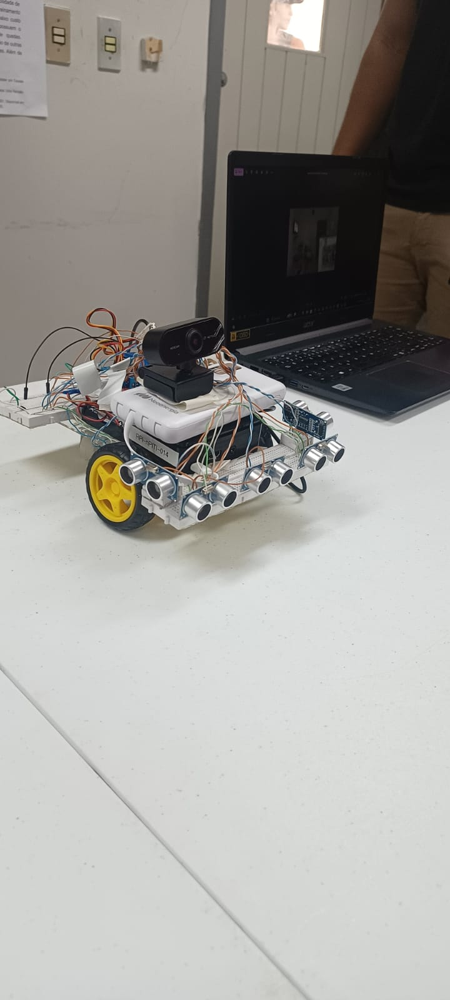
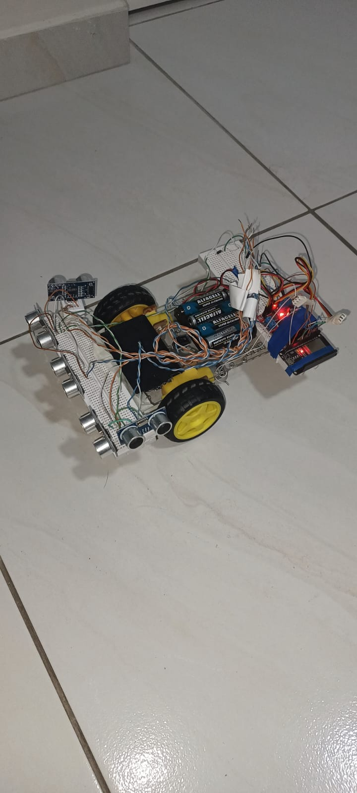
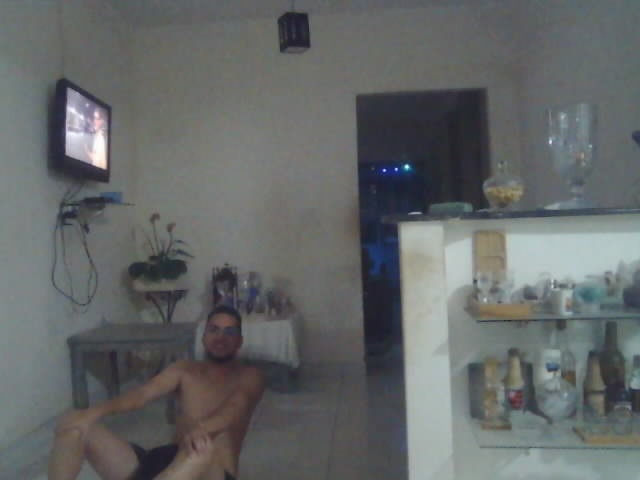

# MonitoringVision-Rover - Projeto de extensão

## Sistema Integrado de Detecção de Quedas e Rover Autônomo


## 📖 Descrição

Este projeto combina **detecção de quedas com visão computacional** e **robótica móvel** para criar um sistema de monitoramento inteligente. O sistema é composto por três componentes principais:

### 🤖 1. Sistema de Detecção de Quedas (YOLOv8 + Raspberry Pi)
Foi treinado um modelo de visão computacional **YOLOv8n** customizado para identificar duas classes: `person` (pessoa) e `fall` (queda). O modelo foi otimizado para **TFLite (INT8)** e **ONNX**, permitindo inferência eficiente em dispositivos embarcados como o Raspberry Pi.

### 🚗 2. Rover Controlado por ESP32
Robô móvel baseado em **ESP32** com driver de motores **L298N**, controlado via **WebSocket** para navegação remota em tempo real.

### 🌐 3. Interface Web de Controle
Sistema de controle web com servidor **Node.js** que atua como relay WebSocket, permitindo controle do rover através de qualquer navegador.

## 📸 Demonstração

### Rover em Ação


*Rover com ESP32 e driver L298N*


*Vista superior mostrando os componentes*

### Sistema de Detecção de Quedas


*Sistema detectando queda em tempo real*

## 📊 Datasets Utilizados

Este modelo foi treinado e validado utilizando os seguintes datasets públicos.

1.  **UR Fall Detection Dataset (URFD)**
    -   **Utilizado para:** Treinamento principal do modelo.
    -   **Link:** [https://universe.roboflow.com/ufddfdd/ur-fall-detection-dataset](https://universe.roboflow.com/ufddfdd/ur-fall-detection-dataset)

2.  **GMDCSA24: A Dataset for Human Fall Detection in Videos**
    -   **Utilizado para:** Teste e validação adicional do modelo treinado.
    -   **Link:** [[Link para o dataset GMDCSA24](https://github.com/ekramalam/GMDCSA24-A-Dataset-for-Human-Fall-Detection-in-Videos)]
    -   **Licença:** MIT License. *Copyright (c) 2024 Ekram Alam.*

## ✨ Funcionalidades

### Sistema de Detecção de Quedas
-   **Detecção em Tempo Real:** Análise de streams de vídeo para identificação imediata de quedas.
-   **Modelo Leve e Rápido:** Utiliza a arquitetura YOLOv8n, ideal para performance em hardware limitado.
-   **Alta Precisão:** O modelo alcançou mAP50 de ~97.5%, treinado no dataset UR Fall Detection e validado no GMDCSA24.
-   **Otimizado para Embarcados:** Exportado para TFLite (INT8) e ONNX, garantindo baixa latência no Raspberry Pi.
-   **Confirmação Inteligente:** Sistema de confirmação multi-frame para evitar falsos positivos.
-   **Alertas Automáticos:** Salva imagem da queda com timestamp e cooldown de 30 segundos entre alertas.
-   **Suporte a Múltiplas Câmeras:** Compatível com câmeras USB e IP (RTSP).

### Rover Autônomo
-   **Controle Remoto via WebSocket:** Navegação em tempo real através de interface web.
-   **Movimentos Precisos:** Frente, ré, rotação esquerda/direita com auto-stop de segurança (2 segundos).
-   **Conexão WiFi Estável:** Auto-reconexão automática em caso de queda de conexão.
-   **Arquitetura Modular:** Fácil expansão para adicionar sensores e funcionalidades.
-   **Baixo Custo:** Utiliza componentes acessíveis (ESP32 + L298N).

## 🛠️ Tecnologias e Ferramentas

### Detecção de Quedas
-   **Linguagens:** Python 3.9+
-   **Frameworks de IA:** Ultralytics (YOLOv8), PyTorch, TensorFlow Lite
-   **Processamento de Imagem:** OpenCV (DNN Module)
-   **Ambiente de Treinamento:** Google Colab (GPU T4)
-   **Hardware:** Raspberry Pi 3B/4 (ou superior)

### Rover e Controle
-   **Microcontrolador:** ESP32 (WiFi integrado)
-   **Framework:** ESP-IDF (FreeRTOS)
-   **Driver de Motores:** L298N H-Bridge
-   **Protocolo:** WebSocket (esp_websocket_client)
-   **Backend:** Node.js 16+ com biblioteca `ws`
-   **Frontend:** HTML5 + JavaScript vanilla

### Ferramentas de Desenvolvimento
-   **Versionamento:** Git
-   **IDE Recomendadas:** VSCode, PlatformIO, Arduino IDE (ESP32)
-   **Treinamento:** Google Colab, Roboflow

## 📁 Estrutura do Projeto

```
MonitoringVision-Rover/
│
├── 📊 Sistema de Detecção de Quedas
│   ├── YOLO_Monitoring_Rover.ipynb    # Notebook Colab (treinamento)
│   ├── fall_detection.py              # Inferência TFLite (Raspberry Pi)
│   ├── fall_detection_opencv.py       # Inferência ONNX (OpenCV DNN)
│   ├── model/
│   │   └── best.pt                    # Modelo YOLOv8 PyTorch
│   ├── best.onnx                      # Modelo exportado ONNX
│   └── requirements.txt               # Dependências Python
│
├── 🤖 Sistema do Rover (ESP32)
│   └── src/esp32/
│       ├── main/
│       │   ├── main.c                 # Firmware ESP32 (controle motores + WebSocket)
│       │   ├── CMakeLists.txt
│       │   └── idf_component.yml      # Dependências ESP-IDF
│       └── managed_components/        # Componentes gerenciados (WebSocket client)
│
├── 🌐 Sistema de Controle Web
│   ├── src/server/
│   │   ├── index.js                   # Servidor WebSocket Node.js
│   │   └── package.json               # Dependências Node.js
│   └── src/web/
│       └── index.html                 # Interface de controle web
│
├── 📚 Documentação
│   ├── README.md                      # Este arquivo
│   ├── CLAUDE.md                      # Guia para Claude Code
│   ├── LICENSE                        # Licença MIT
│   └── docs/                          # Imagens e documentação adicional
│
└── 📈 Resultados
    └── results/                       # Gráficos de treinamento do modelo
```

## ⚙️ Instalação e Configuração

### 📊 Parte 1: Sistema de Detecção de Quedas

#### 1.1 Treinamento do Modelo (Google Colab)

1.  **Abra o Notebook:** Faça o upload e abra o arquivo `YOLO_Monitoring_Rover.ipynb` no Google Colab.
2.  **Configure a API Key:** Adicione sua chave da Roboflow nos "Secrets" do Colab para baixar o dataset.
3.  **Habilite a GPU:** No menu do Colab, vá em `Ambiente de execução > Alterar tipo de ambiente de execução` e selecione "T4 GPU".
4.  **Execute as Células:** Rode as células em sequência para:
    - Instalar dependências
    - Baixar dataset
    - Treinar o modelo YOLOv8n
    - Exportar para TFLite (INT8) e ONNX
5.  **Faça o Download:** Baixe os modelos gerados (`best_int8.tflite` e `best.onnx`).

#### 1.2 Implantação no Raspberry Pi

1.  **Clone o Repositório:**
    ```bash
    git clone https://github.com/seu-usuario/MonitoringVision-Rover.git
    cd MonitoringVision-Rover
    ```

2.  **Instale as Dependências:**
    ```bash
    pip3 install -r requirements.txt
    # Ou para TFLite apenas:
    pip3 install tflite-runtime opencv-python numpy
    ```

3.  **Configure o Script:**
    - Para TFLite: Edite `fall_detection.py` linha 326 com o nome do modelo
    - Para ONNX: Edite `fall_detection_opencv.py` linha 352 com o caminho do modelo
    - Configure a fonte da câmera (0 para USB, URL RTSP para câmera IP)

### 🤖 Parte 2: Rover ESP32

#### 2.1 Pré-requisitos

- **ESP-IDF:** Instale o [ESP-IDF v4.4+](https://docs.espressif.com/projects/esp-idf/en/latest/esp32/get-started/)
- **Hardware:**
  - ESP32 DevKit
  - Driver de motores L298N
  - 2x Motores DC
  - Fonte de alimentação (7-12V para motores)
  - Chassis do rover

#### 2.2 Configuração e Flash

1.  **Configure WiFi e WebSocket:**
    Edite `src/esp32/main/main.c`:
    ```c
    #define WIFI_SSID "sua_rede_wifi"
    #define WIFI_PASS "sua_senha"
    #define WS_SERVER_URI "ws://IP_DO_SERVIDOR:8080"
    ```

2.  **Configure os Pinos (se necessário):**
    Ajuste os pinos GPIO nas linhas 14-22 conforme sua conexão com o L298N.

3.  **Compile e Flash:**
    ```bash
    cd src/esp32
    idf.py build
    idf.py -p COM3 flash monitor  # Windows
    # ou
    idf.py -p /dev/ttyUSB0 flash monitor  # Linux
    ```

### 🌐 Parte 3: Servidor Web e Interface de Controle

#### 3.1 Servidor WebSocket

1.  **Instale Node.js 16+:** [Download](https://nodejs.org/)

2.  **Configure o Servidor:**
    ```bash
    cd src/server
    npm install
    npm start
    ```
    O servidor estará rodando em `ws://0.0.0.0:8080`

#### 3.2 Interface Web

1.  **Abra o Controlador:**
    - Abra `src/web/index.html` em qualquer navegador moderno
    - Ou sirva com um servidor HTTP simples:
      ```bash
      cd src/web
      python -m http.server 3000
      # Acesse: http://localhost:3000
      ```

2.  **Configure o ID do Robô:**
    - Por padrão é "robot1"
    - Deve corresponder ao `DEVICE_ID` no firmware ESP32

## ▶️ Como Usar

### 🎯 Sistema Completo em Funcionamento

#### 1. Inicie o Servidor WebSocket
```bash
cd src/server
npm start
```
Saída esperada: `✅ WS relay running at ws://0.0.0.0:8080`

#### 2. Ligue o Rover ESP32
- Conecte a alimentação do ESP32 e motores
- O ESP32 se conectará automaticamente ao WiFi e ao servidor WebSocket
- Verifique no monitor serial: `🤖 Robot registered: robot1`

#### 3. Abra o Controlador Web
- Abra `src/web/index.html` no navegador
- Verifique a conexão: "Connected to server ws://localhost:8080"
- Use os botões direcionais para controlar o rover:
  - ⬆️ FORWARD - Avançar
  - ⬇️ BACK - Recuar
  - ⬅️ LEFT - Girar à esquerda
  - ➡️ RIGHT - Girar à direita
  - 🛑 STOP - Parar imediatamente

#### 4. Execute a Detecção de Quedas (Raspberry Pi)

**Opção A - TFLite (recomendado para Raspberry Pi):**
```bash
python3 fall_detection.py
```

**Opção B - ONNX (alternativa com OpenCV DNN):**
```bash
python3 fall_detection_opencv.py
```

- O sistema abrirá uma janela mostrando a câmera ao vivo
- Pressione `q` para encerrar
- Quando uma queda for detectada:
  - Imagem será salva: `queda_detectada_YYYYMMDD_HHMMSS.jpg`
  - Alerta exibido na tela
  - Cooldown de 30 segundos entre alertas

## 📡 Arquitetura de Comunicação

```
┌─────────────────┐
│  Navegador Web  │
│  (Controller)   │
└────────┬────────┘
         │ WebSocket
         │ cmd:robot1:FORWARD
         ▼
┌─────────────────┐
│  Node.js Server │ ──────► Registra robôs conectados
│  (WS Relay)     │         Roteia comandos por deviceId
└────────┬────────┘
         │ WebSocket
         │ FORWARD (texto simples)
         ▼
┌─────────────────┐
│  ESP32 Rover    │
│  + L298N        │ ──────► Executa comando
│  + Motores DC   │         Move por 2s + auto-stop
└─────────────────┘
```

**Protocolo:**
- Registro: `register:robot:<deviceId>`
- Comando: `cmd:<deviceId>:<ACTION>`
- Ações: FORWARD, BACK, LEFT, RIGHT, STOP

## 📊 Resultados do Treinamento

### Performance do Modelo YOLOv8n

O modelo alcançou uma performance excelente durante a validação:

- **mAP50:** ~97.5%
- **Classes:** `fallen` (queda) e `person` (pessoa em pé)
- **Dataset Treinamento:** UR Fall Detection Dataset
- **Dataset Validação:** GMDCSA24
- **Resolução de Entrada:** 320x320 (ONNX) / 640x640 (TFLite)
- **Tempo de Inferência:**
  - Raspberry Pi 3B: ~0.3-0.5s por frame (TFLite)
  - Raspberry Pi 4: ~0.15-0.25s por frame (TFLite)


## 🔧 Troubleshooting

### Problemas Comuns

**ESP32 não conecta ao WiFi:**
- Verifique SSID e senha em `main.c`
- Certifique-se de usar WiFi 2.4GHz (ESP32 não suporta 5GHz)
- Verifique o monitor serial: `idf.py monitor`

**Rover não responde aos comandos:**
- Confirme que o servidor WebSocket está rodando
- Verifique se o ESP32 se registrou com sucesso (`🤖 Robot registered`)
- Teste os motores individualmente ajustando GPIO diretamente
- Verifique alimentação do L298N (7-12V)

**Detecção de quedas com muitos falsos positivos:**
- Aumente `CONFIDENCE_THRESHOLD` (padrão: 0.4)
- Aumente `FALL_CONFIRM_FRAMES` (padrão: 10 frames consecutivos)
- Verifique iluminação do ambiente

**Performance baixa no Raspberry Pi:**
- Use `fall_detection.py` (TFLite) ao invés de OpenCV
- Aumente `frame_skip` para processar menos frames
- Reduza resolução da câmera

**Servidor WebSocket desconecta frequentemente:**
- Verifique firewall/antivírus bloqueando porta 8080
- Use IP fixo ao invés de localhost em redes diferentes

## 🚀 Melhorias Futuras

- [ ] Integração entre detecção de quedas e rover (rover se move automaticamente ao detectar queda)
- [ ] Sistema de notificação (SMS, Email, Push)
- [ ] Streaming de vídeo da câmera do Raspberry Pi para interface web
- [ ] Controle de velocidade PWM dos motores
- [ ] Adição de sensores (ultrassônico, IMU) no rover
- [ ] App mobile para controle do rover
- [ ] Gravação de vídeo automática ao detectar queda
- [ ] Dashboard web com histórico de detecções
- [ ] Suporte a múltiplos rovers simultâneos


## 📄 Licença

O código-fonte **deste projeto** está sob a licença MIT. Veja o arquivo `LICENSE` para mais detalhes.

É importante notar que os datasets utilizados neste projeto possuem suas próprias licenças, que devem ser respeitadas. A utilização do dataset GMDCSA24, em particular, requer a inclusão de seu aviso de copyright original, conforme estipulado pela sua licença MIT.

---
*Criado por Luiz Felipe, Arthur Cruz e Jacson Arruda*
